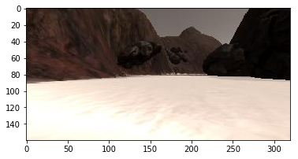
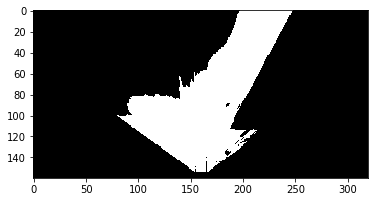
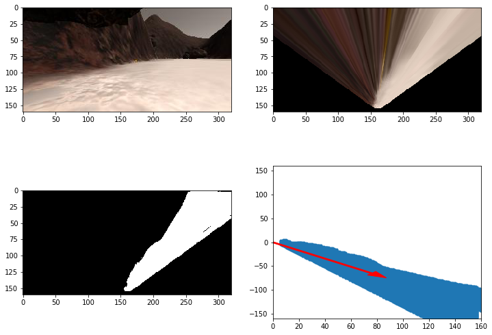

# Notebook Analysis


```python
%%HTML
<style> code {background-color : orange !important;} </style>
```


<style> code {background-color : orange !important;} </style>


```python
%matplotlib inline
#%matplotlib qt # Choose %matplotlib qt to plot to an interactive window (note it may show up behind your browser)
# Make some of the relevant imports
import cv2 # OpenCV for perspective transform
import numpy as np
import matplotlib.image as mpimg
import matplotlib.pyplot as plt
import scipy.misc # For saving images as needed
import glob  # For reading in a list of images from a folder
import imageio
imageio.plugins.ffmpeg.download()

```

## Quick Look at the Data
Read in and display a random image from my folder


```python
path = 'C:/Users/HDSupport1/Desktop/mishkat/IMG/*'
img_list = glob.glob(path)
# Grab a random image and display it
image = mpimg.imread(img_list[idx])
plt.imshow(image)
```


    <matplotlib.image.AxesImage at 0xf6f9828>





## Calibration Data

Read in and display example grid and rock sample calibration images. You'll use the grid for perspective transform and the rock image for creating a new color selection that identifies these samples of interest.


```python

example_grid = '../calibration_images/example_grid1.jpg'

example_rock = '../calibration_images/example_rock1.jpg'
grid_img = mpimg.imread(example_grid)
rock_img = mpimg.imread(example_rock)

fig = plt.figure(figsize=(12,3))
plt.subplot(121)
plt.imshow(grid_img)
plt.subplot(122)
plt.imshow(rock_img)


```


    <matplotlib.image.AxesImage at 0xf4a85c0>


## Perspective Transform

Define the perspective transform function from the lesson and test it on an image.


```python
# Define a function to perform a perspective transform
# I've used the example grid image above to choose source points for the
# grid cell in front of the rover (each grid cell is 1 square meter in the sim)
# Define a function to perform a perspective transform
def perspect_transform(img, src, dst):
           
    M = cv2.getPerspectiveTransform(src, dst)
    warped = cv2.warpPerspective(img, M, (img.shape[1], img.shape[0]))# keep same size as input image
    mask = cv2.warpPerspective(np.ones_like(img[:,:,0]),M,(img.shape[1],img.shape[0]))
    return warped,mask

# Define calibration box in source (actual) and destination (desired) coordinates
# These source and destination points are defined to warp the image
# to a grid where each 10x10 pixel square represents 1 square meter
# The destination box will be 2*dst_size on each side
dst_size = 5 
# Set a bottom offset to account for the fact that the bottom of the image 
# is not the position of the rover but a bit in front of it
# this is just a rough guess, feel free to change it!
bottom_offset = 6
source = np.float32([[14, 140], [301 ,140],[200, 96], [118, 96]])
destination = np.float32([[image.shape[1]/2 - dst_size, image.shape[0] - bottom_offset],
                  [image.shape[1]/2 + dst_size, image.shape[0] - bottom_offset],
                  [image.shape[1]/2 + dst_size, image.shape[0] - 2*dst_size - bottom_offset], 
                  [image.shape[1]/2 - dst_size, image.shape[0] - 2*dst_size - bottom_offset],
                  ])
warped,mask = perspect_transform(grid_img, source, destination)
plt.subplot(121)
plt.imshow(warped)
plt.subplot(122)
plt.imshow(mask,cmap='gray')
#scipy.misc.imsave('../output/warped_example.jpg', warped)
```


    <matplotlib.image.AxesImage at 0xf56bb70>


## Color Thresholding
Define the color thresholding function from the lesson and apply it to the warped image.


```python
# Identify pixels above the threshold
# Threshold of RGB > 160 does a nice job of identifying ground pixels only
def color_thresh(img, rgb_thresh=(160, 160, 160)):
    # Create an array of zeros same xy size as img, but single channel
    color_select = np.zeros_like(img[:,:,0])
    # Require that each pixel be above all three threshold values in RGB
    # above_thresh will now contain a boolean array with "True"
    # where threshold was met
    above_thresh = (img[:,:,0] > rgb_thresh[0]) \
                & (img[:,:,1] > rgb_thresh[1]) \
                & (img[:,:,2] > rgb_thresh[2])
    # Index the array of zeros with the boolean array and set to 1
    color_select[above_thresh] = 1
    # Return the binary image
    return color_select

threshed = color_thresh(warped)
plt.imshow(threshed, cmap='gray')
#scipy.misc.imsave('../output/warped_threshed.jpg', threshed*255)
```


    <matplotlib.image.AxesImage at 0xf5bee48>





# Here I have a new function to identify yellow rocks i have used opencv library 


```python
def id_yellow_rock(rock_img):
    bgr = cv2.cvtColor(rock_img, cv2.COLOR_RGB2BGR)
    hsv = cv2.cvtColor(bgr, cv2.COLOR_BGR2HSV)
    lower_yellow = np.array([20,100,100])
    upper_yellow = np.array([40,255,255])
    mask = cv2.inRange(hsv, lower_yellow, upper_yellow)
    return mask
```

## Coordinate Transformations
Define the functions used to do coordinate transforms and apply them to an image.


```python
# Define a function to convert from image coords to rover coords
def rover_coords(binary_img):
    # Identify nonzero pixels
    ypos, xpos = binary_img.nonzero()
    # Calculate pixel positions with reference to the rover position being at the 
    # center bottom of the image.  
    x_pixel = -(ypos - binary_img.shape[0]).astype(np.float)
    y_pixel = -(xpos - binary_img.shape[1]/2 ).astype(np.float)
    return x_pixel, y_pixel

# Define a function to convert to radial coords in rover space
def to_polar_coords(x_pixel, y_pixel):
    # Convert (x_pixel, y_pixel) to (distance, angle) 
    # in polar coordinates in rover space
    # Calculate distance to each pixel
    dist = np.sqrt(x_pixel**2 + y_pixel**2)
    # Calculate angle away from vertical for each pixel
    angles = np.arctan2(y_pixel, x_pixel)
    return dist, angles

# Define a function to map rover space pixels to world space
def rotate_pix(xpix, ypix, yaw):
    # Convert yaw to radians
    yaw_rad = yaw * np.pi / 180
    xpix_rotated = (xpix * np.cos(yaw_rad)) - (ypix * np.sin(yaw_rad))
                            
    ypix_rotated = (xpix * np.sin(yaw_rad)) + (ypix * np.cos(yaw_rad))
    # Return the result  
    return xpix_rotated, ypix_rotated

def translate_pix(xpix_rot, ypix_rot, xpos, ypos, scale): 
    # Apply a scaling and a translation
    xpix_translated = (xpix_rot / scale) + xpos
    ypix_translated = (ypix_rot / scale) + ypos
    # Return the result  
    return xpix_translated, ypix_translated


# Define a function to apply rotation and translation (and clipping)
# Once you define the two functions above this function should work
def pix_to_world(xpix, ypix, xpos, ypos, yaw, world_size, scale):
    # Apply rotation
    xpix_rot, ypix_rot = rotate_pix(xpix, ypix, yaw)
    # Apply translation
    xpix_tran, ypix_tran = translate_pix(xpix_rot, ypix_rot, xpos, ypos, scale)
    # Perform rotation, translation and clipping all at once
    x_pix_world = np.clip(np.int_(xpix_tran), 0, world_size - 1)
    y_pix_world = np.clip(np.int_(ypix_tran), 0, world_size - 1)
    # Return the result
    return x_pix_world, y_pix_world

# Grab another random image
idx = np.random.randint(0, len(img_list)-1)
image = mpimg.imread(img_list[idx])
warped,mask = perspect_transform(image, source, destination)
threshed = color_thresh(warped)

# Calculate pixel values in rover-centric coords and distance/angle to all pixels
xpix, ypix = rover_coords(threshed)
dist, angles = to_polar_coords(xpix, ypix)
mean_dir = np.mean(angles)

# Do some plotting
fig = plt.figure(figsize=(12,9))
plt.subplot(221)
plt.imshow(image)
plt.subplot(222)
plt.imshow(warped)
plt.subplot(223)
plt.imshow(threshed, cmap='gray')
plt.subplot(224)
plt.plot(xpix, ypix, '.')
plt.ylim(-160, 160)
plt.xlim(0, 160)
arrow_length = 100
x_arrow = arrow_length * np.cos(mean_dir)
y_arrow = arrow_length * np.sin(mean_dir)
plt.arrow(0, 0, x_arrow, y_arrow, color='red', zorder=2, head_width=10, width=2)


```


    <matplotlib.patches.FancyArrow at 0xf92eac8>





## Read in saved data and ground truth map of the world
The next cell is all setup to read your saved data into a `pandas` dataframe.  Here you'll also read in a "ground truth" map of the world, where white pixels (pixel value = 1) represent navigable terrain.  

After that, we'll define a class to store telemetry data and pathnames to images.  When you instantiate this class (`data = Databucket()`) you'll have a global variable called `data` that you can refer to for telemetry and map data within the `process_image()` function in the following cell.  


```python
import pandas as pd

df = pd.read_csv('C:/Users/HDSupport1/Desktop/mishkat/robot_log.csv', delimiter=';', decimal='.')
csv_img_list = df["Path"].tolist() # Create list of image pathnames
# Read in ground truth map and create a 3-channel image with it
ground_truth = mpimg.imread('../calibration_images/map_bw.png')
ground_truth_3d = np.dstack((ground_truth*0, ground_truth*255, ground_truth*0)).astype(np.float)

class Databucket():
    def __init__(self):
        self.images = csv_img_list  
        self.xpos = df["X_Position"].values
        self.ypos = df["Y_Position"].values
        self.yaw = df["Yaw"].values
        self.count = 0 # This will be a running index
        self.worldmap = np.zeros((200, 200, 3)).astype(np.float)
        self.ground_truth = ground_truth_3d # Ground truth worldmap

data = Databucket()

```

## Write a function to process stored images

Modify the `process_image()` function below by adding in the perception step processes (functions defined above) to perform image analysis and mapping.  The following cell is all set up to use this `process_image()` function in conjunction with the `moviepy` video processing package to create a video from the images you saved taking data in the simulator.  

In short, you will be passing individual images into `process_image()` and building up an image called `output_image` that will be stored as one frame of video.  You can make a mosaic of the various steps of your analysis process and add text as you like (example provided below).  


To start with, you can simply run the next three cells to see what happens, but then go ahead and modify them such that the output video demonstrates your mapping process.  Feel free to get creative!


```python

# Define a function to pass stored images to
# reading rover position and yaw angle from csv file
# This function will be used by moviepy to create an output video

# Define a function to pass stored images to
# reading rover position and yaw angle from csv file
# This function will be used by moviepy to create an output video
def process_image(img):
    warped, mask = perspect_transform(img, source, destination)
    threshed = color_thresh(warped)
    obs_map = np.absolute(np.float32(threshed)-1) * mask
    xpix, ypix = rover_coords(threshed)
    xpos = data.xpos[data.count]
    ypos = data.ypos[data.count]
    yaw = data.yaw[data.count]
    world_size = data.worldmap.shape[0]
    scale = 2 * dst_size
    x_world, y_world = pix_to_world(xpix,ypix,xpos,ypos,yaw,world_size, scale)
    
    obsxpix, obsypix = rover_coords(obs_map)
    obs_x_world, obs_y_world = pix_to_world(obsxpix,obsypix,xpos,ypos,yaw,world_size,scale)
    
    data.worldmap[y_world, x_world, 2] = 255
    data.worldmap[obs_y_world, obs_x_world, 0] = 255
    nav_pix = data.worldmap[:,:,2] > 0
    
    data.worldmap[nav_pix, 0] = 0
    
    #see if we find some rock
    rock_map = id_yellow_rock(warped)
    
    if rock_map.any():
        rock_x, rock_y = rover_coords(rock_map)
        rock_x = np.argmin(rock_x)
        rock_y = np.argmin(rock_y)
        rock_x_world, rock_y_world = pix_to_world(rock_x, rock_y, xpos, ypos, yaw,world_size, scale)
        data.worldmap[rock_y_world, rock_x_world,:] = [255,255,0]        
        
        # 7) Make a mosaic image, below is some example code
        # First create a blank image (can be whatever shape you like)
    output_image = np.zeros((img.shape[0] + data.worldmap.shape[0], img.shape[1]*2, 3))
        # Next you can populate regions of the image with various output
        # Here I'm putting the original image in the upper left hand corner
    output_image[0:img.shape[0], 0:img.shape[1]] = img
        
        # Add the warped image in the upper right hand corner
    output_image[0:img.shape[0], img.shape[1]:] = warped

        # Overlay worldmap with ground truth map
    map_add = cv2.addWeighted(data.worldmap, 1, data.ground_truth, 0.5, 0)
        # Flip map overlay so y-axis points upward and add to output_image 
    output_image[img.shape[0]:, 0:data.worldmap.shape[1]] = np.flipud(map_add)


        # Then putting some text over the image
    cv2.putText(output_image,"Populate this image with your analyses to make a video!", (20, 20), 
                cv2.FONT_HERSHEY_COMPLEX, 0.4, (255, 255, 255), 1)
    if data.count < len(data.images) - 1:
        data.count += 1 # Keep track of the index in the Databucket()

    
    
    return output_image
    

```

## Make a video from processed image data
Use the [moviepy](https://zulko.github.io/moviepy/) library to process images and create a video.
  


```python
# Import everything needed to edit/save/watch video clips
from moviepy.editor import VideoFileClip
from moviepy.editor import ImageSequenceClip


# Define pathname to save the output video
output = '../output/test_mapping.mp4'
data = Databucket() # Re-initialize data in case you're running this cell multiple times
clip = ImageSequenceClip(data.images, fps=60) # Note: output video will be sped up because 
                                          # recording rate in simulator is fps=25
new_clip = clip.fl_image(process_image) #NOTE: this function expects color images!!
%time new_clip.write_videofile(output, audio=False)
```

    [MoviePy] >>>> Building video ../output/test_mapping.mp4
    [MoviePy] Writing video ../output/test_mapping.mp4
    

    
      0%|          | 0/248 [00:00<?, ?it/s]
      1%|          | 3/248 [00:00<00:08, 27.78it/s]
      5%|▍         | 12/248 [00:00<00:06, 35.05it/s]
      8%|▊         | 21/248 [00:00<00:05, 42.30it/s]
     12%|█▏        | 30/248 [00:00<00:04, 49.96it/s]
     16%|█▌        | 40/248 [00:00<00:03, 57.97it/s]
     19%|█▉        | 48/248 [00:00<00:03, 62.60it/s]
     23%|██▎       | 56/248 [00:00<00:03, 63.76it/s]
     26%|██▌       | 65/248 [00:00<00:02, 68.91it/s]
     30%|██▉       | 74/248 [00:00<00:02, 73.76it/s]
     33%|███▎      | 83/248 [00:01<00:02, 77.58it/s]
     37%|███▋      | 92/248 [00:01<00:01, 80.49it/s]
     41%|████      | 101/248 [00:01<00:01, 81.99it/s]
     44%|████▍     | 110/248 [00:01<00:01, 83.77it/s]
     48%|████▊     | 119/248 [00:01<00:01, 84.34it/s]
     52%|█████▏    | 128/248 [00:01<00:01, 83.57it/s]
     55%|█████▌    | 137/248 [00:01<00:01, 83.73it/s]
     59%|█████▉    | 146/248 [00:01<00:01, 84.55it/s]
     63%|██████▎   | 156/248 [00:01<00:01, 85.70it/s]
     67%|██████▋   | 165/248 [00:02<00:00, 84.98it/s]
     71%|███████   | 175/248 [00:02<00:00, 87.35it/s]
     74%|███████▍  | 184/248 [00:02<00:00, 87.87it/s]
     78%|███████▊  | 193/248 [00:02<00:00, 86.21it/s]
     81%|████████▏ | 202/248 [00:02<00:00, 86.56it/s]
     85%|████████▌ | 211/248 [00:02<00:00, 84.13it/s]
     89%|████████▊ | 220/248 [00:02<00:00, 84.84it/s]
     92%|█████████▏| 229/248 [00:02<00:00, 85.58it/s]
     96%|█████████▌| 238/248 [00:02<00:00, 84.66it/s]
    100%|█████████▉| 247/248 [00:02<00:00, 85.45it/s]
    100%|██████████| 248/248 [00:02<00:00, 82.97it/s]

    [MoviePy] Done.
    [MoviePy] >>>> Video ready: ../output/test_mapping.mp4 
    
    Wall time: 3.15 s
    

### This next cell should function as an inline video player
If this fails to render the video, try running the following cell (alternative video rendering method).  You can also simply have a look at the saved mp4 in your `/output` folder


```python

from IPython.display import HTML
HTML("""
<video width="960" height="540" controls>
  <source src="{0}">
</video>
""".format(output))
```


<video width="960" height="540" controls>
  <source src="../output/test_mapping.mp4">
</video>


### Below is an alternative way to create a video in case the above cell did not work.


```python
import io
import base64
video = io.open(output, 'r+b').read()
encoded_video = base64.b64encode(video)
HTML(data='''<video alt="test" controls>
                <source src="data:video/mp4;base64,{0}" type="video/mp4" />
             </video>'''.format(encoded_video.decode('ascii')))
```
